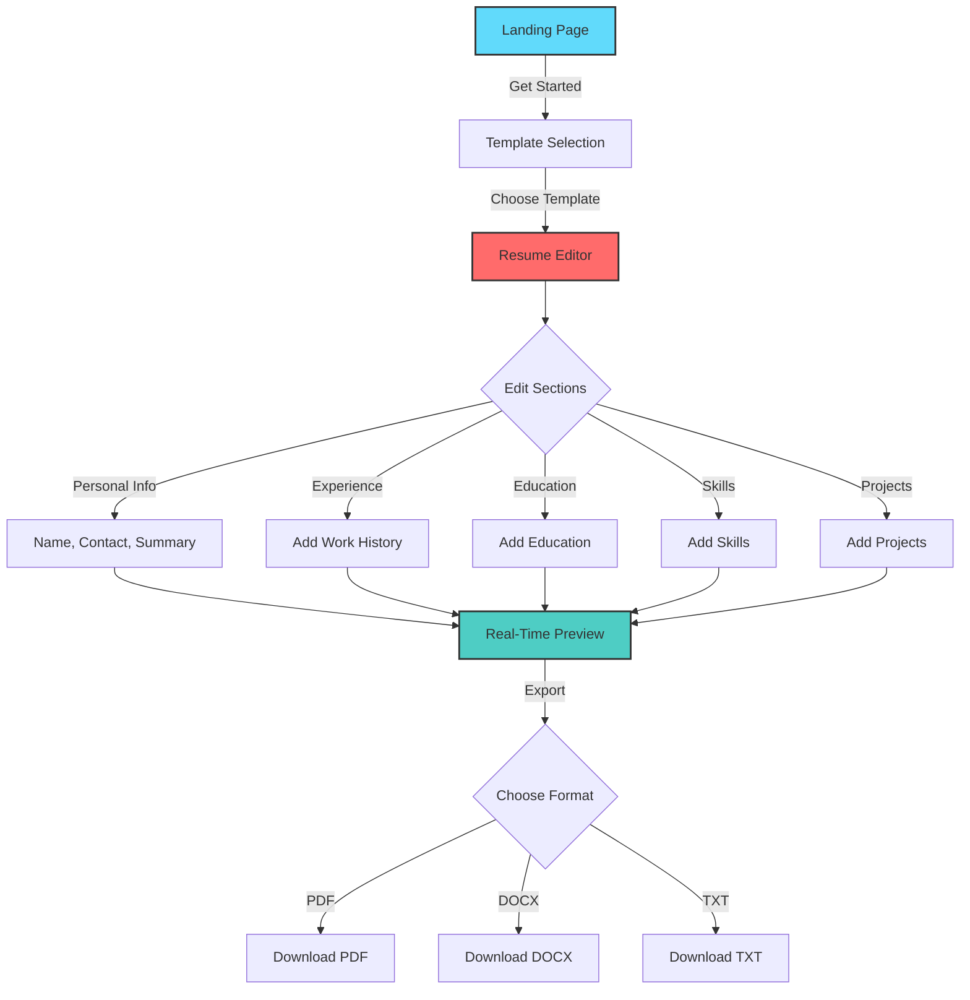
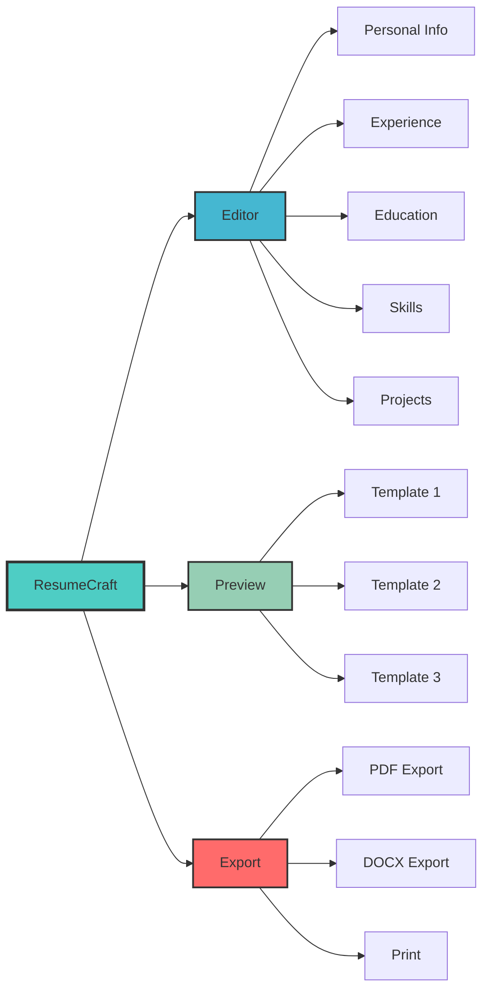

# 📄 ResumeCraft

<div align="center">


[](https://reactjs.org/)
[](https://www.typescriptlang.org/)
[](https://tailwindcss.com/)
[](https://vitejs.dev/)

**Your one-stop solution for creating professional, ATS-friendly resumes in minutes**

[Live Demo](#) • [Report Bug](https://github.com/pokie-heisenberg/ResumeCraft/issues) • [Request Feature](https://github.com/pokie-heisenberg/ResumeCraft/issues)

</div>

---

## 💡 What is ResumeCraft?

ResumeCraft is a modern, intuitive resume builder designed to help job seekers create professional resumes that stand out. Whether you're a fresh graduate entering the job market or an experienced professional looking to switch careers, ResumeCraft provides you with the tools to showcase your skills and experience effectively.

**No more struggling with Word templates or expensive resume services** - create, customize, and download your perfect resume in minutes, completely free!

## ✨ Key Features

### 🎨 Beautiful Templates
Choose from multiple professionally designed, ATS-optimized templates that help you stand out while passing through Applicant Tracking Systems.

### ⚡ Real-Time Preview
See your changes instantly as you type. What you see is exactly what you get - no surprises when you download.

### 💾 Auto-Save & Local Storage
Never lose your progress! Your resume data is automatically saved to your browser's local storage and persists across sessions.

### 📱 Fully Responsive
Create your resume on any device - desktop, tablet, or mobile. The editor adapts seamlessly to your screen size.

### 🎯 Smart Sections
Easily manage multiple sections:
- **Personal Information** - Contact details and professional summary
- **Work Experience** - Add multiple positions with detailed descriptions
- **Education** - List your academic achievements
- **Skills** - Showcase technical and soft skills
- **Projects** - Highlight your notable work
- **Certifications** - Display your credentials
- **Custom Sections** - Add any additional sections you need

### 📥 Multiple Export Formats
Download your resume as:
- **PDF** - Industry standard format
- **DOCX** - Editable Word document
- **Plain Text** - For ATS optimization

### 🌙 Dark Mode Support
Easy on the eyes with full dark mode support for comfortable late-night resume building sessions.

---

## 🛠️ Tech Stack

| Technology | Purpose |
|------------|---------|
| **React 18** | Component-based UI architecture |
| **TypeScript** | Type-safe development |
| **Vite** | Lightning-fast builds & HMR |
| **Tailwind CSS** | Utility-first styling |
| **Framer Motion** | Smooth animations |
| **React Router** | Client-side routing |
| **jsPDF** | PDF generation |
| **html2canvas** | HTML to canvas conversion |
| **Lucide React** | Beautiful icon library |

---

## 🚀 Getting Started

### Prerequisites
- Node.js (v16+)
- npm or yarn or pnpm

### Installation

```bash
# Clone the repository
git clone https://github.com/pokie-heisenberg/ResumeCraft.git

# Navigate to project directory
cd ResumeCraft

# Install dependencies
npm install

# Start development server
npm run dev
```

Visit `http://localhost:5173` to see the app running!

### Building for Production

```bash
# Create optimized production build
npm run build

# Preview production build
npm run preview
```

---

## 🎨 Application Flow



### Feature Architecture




---

## 🎯 How It Works

### For Job Seekers

1. **Choose Template**: Browse through our collection of professional templates
2. **Fill Information**: Add your details section by section with helpful prompts
3. **See Live Preview**: Watch your resume take shape in real-time
4. **Customize**: Adjust colors, fonts, and layout to match your style
5. **Export**: Download in your preferred format (PDF/DOCX)
6. **Edit Anytime**: Your data is saved locally - come back anytime to update

### Key Interactions

- **Drag & Drop**: Reorder sections by dragging them
- **Rich Text Editing**: Format your content with bold, italic, and bullet points
- **Instant Feedback**: Form validation ensures your data is complete
- **Keyboard Shortcuts**: Speed up your workflow with shortcuts
  - `Ctrl/Cmd + S` - Save changes
  - `Ctrl/Cmd + P` - Quick export
  - `Ctrl/Cmd + Z` - Undo changes

---

## 🌟 What Makes ResumeCraft Special?

| Feature | Why It Matters |
|---------|----------------|
| **ATS-Friendly** | Templates designed to pass Applicant Tracking Systems |
| **Privacy First** | All data stored locally - we never see your information |
| **Zero Cost** | Completely free with no hidden premium features |
| **No Sign-Up** | Start creating immediately without creating an account |
| **Modern Design** | Clean, professional layouts that impress recruiters |
| **Responsive** | Works perfectly on any device |

---


## 🤝 Contributing

We love contributions! Here's how you can help:

### Ways to Contribute
- 🐛 Report bugs
- 💡 Suggest new features
- 📝 Improve documentation
- 🎨 Design new templates
- 💻 Submit pull requests

### Getting Started

1. Fork the repository
2. Create your feature branch
   ```bash
   git checkout -b feature/AmazingFeature
   ```
3. Commit your changes
   ```bash
   git commit -m 'Add some AmazingFeature'
   ```
4. Push to the branch
   ```bash
   git push origin feature/AmazingFeature
   ```
5. Open a Pull Request

---

## 📄 License

This project is licensed under the MIT License - see the [LICENSE](LICENSE) file for details.

---

## 🙏 Acknowledgments

- Inspired by the need for accessible, quality resume tools
- Thanks to all open-source libraries that made this possible
- Special thanks to the community for feedback and contributions

---

## 📞 Support & Community

- **Issues**: [GitHub Issues](https://github.com/pokie-heisenberg/ResumeCraft/issues)
- **Discussions**: [GitHub Discussions](https://github.com/pokie-heisenberg/ResumeCraft/discussions)
- **Email**: sarthakparkale15@gmail.com

---

<div align="center">

**Built with ❤️ to help job seekers land their dream roles**

Made by [pokie-heisenberg](https://github.com/pokie-heisenberg)[Sarthak](https://github.com/Failureguy94)

⭐ Star this repo if it helps you land your next job!

[🌟 Star](https://github.com/pokie-heisenberg/ResumeCraft) • [🐛 Report Bug](https://github.com/pokie-heisenberg/ResumeCraft/issues) • [💡 Request Feature](https://github.com/pokie-heisenberg/ResumeCraft/issues)

</div>
